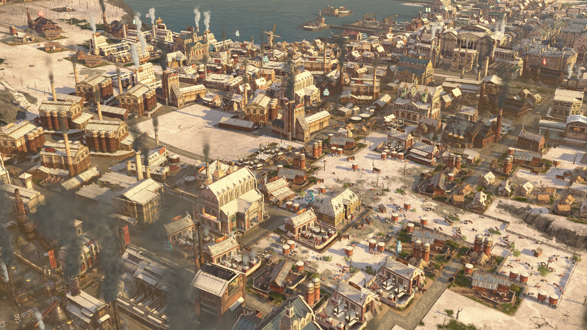
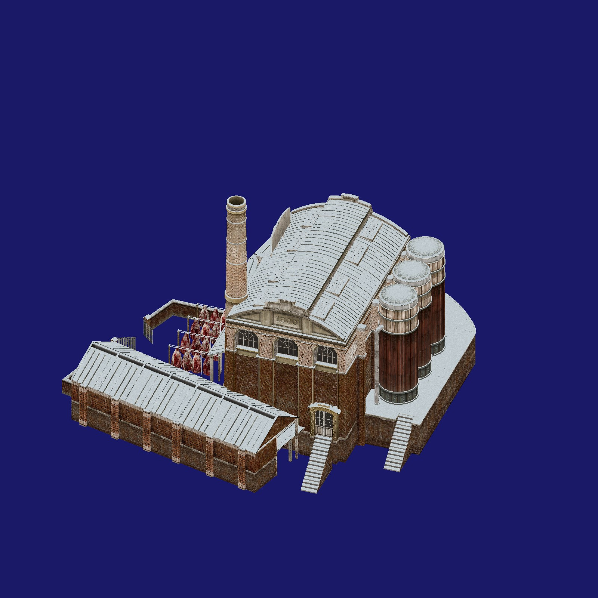

# Generate snow for buildings from Anno 1800

This is a command line tool you can use for generating snow on the roofs of buildings from the video game Anno 1800. It loads the original asset (.cfg file) as well as the .rdm meshes and .dds textures that are referenced in it. It then saves alternative versions of the textures where parts that are facing upward are covered with snow.



_How the result looks like ingame_



_The tool displays an isometric rendering of the file currently being processed._


Be warned that the tool is not 100% reliable. It often generates incorrect or no snow and may even crash on some files.

## Command line arguments

_Note: All those arguments are optional. It is possible to place it in a folder and just double-click it - it will follow default behaviour then._

In contrast to the old SecondTry.exe program, the predecessor of this tool, the snowgenerator offers a lot of options.

```-h```/```--help```/```--manual``` Display a help message

```--licenses``` Display the licenses of open source libraries used by this project


```-o "C:/path/to/output/"```/```-out_path "C:/path/to/output/"```/```-output "C:/path/to/output/"``` - Specify a directory where the output should be stored. If none is specified, the tool will create a folder called "[Winter] Snow" in the directory where the tool is located and save the output there.

```-i "C:/path/to/input/"```/```-in_path "C:/path/to/input/"```/```-input "C:/path/to/input/"``` - Specify the input directory. It will generate snow for all CFGs found in subfolders of the input directory. It is also possible to pass a single .cfg file. If none is specified, it will scan the folder where the tool is located.


```-d "D:/extracted_maindata/"```/```-data "D:/extracted_maindata/"```/```-data_path "D:/extracted_maindata/"``` - Optionally specify the directory where you extracted the maindata from the .rda files, not including data/. This is useful when generating snow for mods. When textures and meshes for a .cfg file are loaded, the program finds the /data/ directory where the .cfg is located and tries to load textures/meshes from that data/ directory. If they are not found, the program will try to load them from the path passed as ```-d```.

```--save_non_mod_textures```/```--save_vanilla``` - If a textures was loaded from the fallback path specified by ```-d```, its snowed version will not be exported by default - only if this flag is set.


```--no_filename_filters```/```--no_ff``` - Do not filter out CFGs whose path contains keywords indicating that they do not belong to the Old World. Examples are "colony", "ship" or "dlc06".

```--no_texture_blacklist```/```--no_tex_ff``` - Even if ```--no_filename_filters``` is set, textures are filtered out if their path contains "_ground", "atlas" or some other keywords. Setting this flag disables this behaviour.


```--atlas_mode```/```--atlasses``` - Atlas mode: When generating snow on a texture that has been processed before, the tool adds snow to the already snowed texture instead of overwriting it. Additionally, the ```--no_texture_blacklist``` is set. This flag is intended for generating snow on textures that are shared among many assets.


```--save_png``` - Save miplevel 0 of each of the generated snowed textures as a .png file.
```--no_dds``` - Do not export the generated textures to .dds files (Speeding up performance a lot).
```--only_png``` - Combination of the two. Save one .png file instead of the .dds mipmaps.


```--save_renderings``` - Save the isometric renderings displayed in the viewport as .jpg files (in a separate folder in the output directory)


```--steep_overwrites_flat```/```--minimal_snow_per_fragment``` - If the same part of the texture is used by different parts of the mesh, the steepest one will count, leading to less snow overall. May be useful if snow is generated in parts where it should not. There is also ```--flat_overwrites_steep```/```--maximal_snow_per_fragment```, which does nothing because it is the default.


```--no_prompt```/```--noprompt``` - Do not wait for the user to hit Enter when the program has finished before terminating. This is useful when running the tool from an external script.


## Currently blacklisted files


**Everything containing one of the following strings is filtered:**
- colony             (Filters New World, Arctic, Enbesa)
- south_america
- polar
- africa
- /eoy21/
- /ui/
- /cutout_objects/
- /effects/
- /portraits/
- /units/
- /vehicle
- /cdlc05/           (Pedestrian Zone - Also used in NW)
- /dlc03             (No additional snow for the arctic. Gas Power Plant on whitelist.)
- /dlc06             (Land of Lions - Scholar houses + research institute on whitelist)
- 3rd_party_04       (Jean La Fortune)
- 3rd_party_05       (Isabel Sarmento)
- 3rd_party_09       (Inuit)
- 3rd_party_10       (Waha Desher)
- 3rd_party_13       (Ketema)
- ship
- feedback
- fb
- quest_unit
- shared_ornaments
- quay_system
- jungle
- /props/clothing_elements/
- data/graphics/buildings/special/bridges (Also used in NW)
- /quest/objects/
- /campaign/burned_ruins/
- /campaign/fisher_village/
- /campaign/magistrate_shack/
- /residence_tier03_01/                   (Broken file)
- [Winter]                                (Don't generate snow twice (CFGs for test purposes in the output directory))


**Excluded from the blacklist are:**
- data/dlc03/graphics/buildings/special/electricity_02        (Gas Power Plant)
- data/dlc06/graphics/buildings/public/monument_02",          (Research institute)
- data/dlc06/graphics/buildings/residence/residence_tier06    (Scholar houses)
- shipyard


**Textures are filtered if their path contains:**
- atlas
- quay_system
- data/graphics/buildings/3rd_party/3rd_party_06/maps/3rd_party_06_  (Old Nate)
- bridges
- _ground